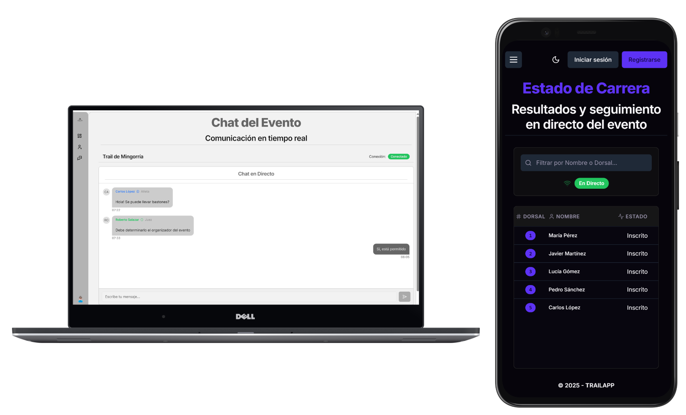

# TrailApp Frontend 🏞️🏃‍♂️

Bienvenido al repositorio del frontend de TrailApp.

TrailApp es una aplicación diseñada para simplificar la gestión y el control de material en carreras de trail running, abordando los desafíos específicos que enfrentan los jueces de atletismo y los organizadores de eventos.



## ✨ Descripción del Proyecto

La aplicación TrailApp tiene como objetivo centralizar la gestión de eventos de trail running, proporcionando herramientas a diversos usuarios para organizar, supervisar y participar en carreras de montaña. Permite a usuarios generales consultar eventos y el estado en tiempo real de los participantes, mientras que roles específicos como federaciones, organizadores, jueces y atletas tienen acceso a funcionalidades avanzadas adaptadas a sus necesidades.

## 🚀 Características Principales

TrailApp ofrece un amplio conjunto de funcionalidades distribuidas entre diferentes perfiles de usuario:

*   **👤 Usuarios Generales (público general) y Registrados:**
    *   Acceso al listado público de eventos (ubicación, fecha, etc.).
    *   Visualización en tiempo real del estado de carrera para cada evento (listado de participantes y su progreso), actualizado mediante **sockets**.
*   **👑 Federación Nacional (RFEA):**
    *   Alta de nuevas federaciones autonómicas. 
    *   Gestión de designaciones de jueces cedidas por federaciones autonómicas (asignar jueces, eliminar, devolver). 
*   **🗺️ Federación Autonómica:**
    *   Alta de organizadores. 
    *   Validación o rechazo de registros de jueces asociados a su federación.
    *   Validación o rechazo de eventos en su territorio. 
    *   Administración de eventos (editar, eliminar). 
    *   Asignación de jueces a eventos de su territorio (incluyendo el Juez Árbitro obligatorio). 
    *   Posibilidad de ceder designaciones de jueces a la RFEA. 
*   **🛠️ Organizadores:**
    *   Creación de nuevos eventos. 
    *   Asignación de material obligatorio y voluntario a los eventos. 
    *   Visualización de eventos validados. 
    *   Consulta del listado de inscripciones por evento.
    *   Descarga en PDF del listado de inscripciones y dorsales. 
*   **🏃‍♀️ Atletas:**
    *   Auto-registro y validación de correo electrónico. 
    *   Inscripción a eventos y distancias. 
    *   Acceso a chat de eventos en los que están inscritos. 
*   **⚖️ Jueces:**
    *   Auto-registro con selección de federación autonómica y validación de correo electrónico. 
    *   Acceso a funcionalidades de control de eventos (si han sido designados y validados). 
    *   **Día del Evento (Jueces Designados):**
        *   Envío de partes de descalificación (atleta, motivo, descripción). 
        *   Realización de controles de material (elegir control, indicar atleta y material portado). 
        *   Gestión inteligente del material por el sistema (detección automática de anomalías en controles y bolsa de vida). 
    *   **🧑‍⚖️ Juez Árbitro:**
        *   Visualización, aceptación o rechazo de partes de descalificación enviados por otros jueces. 
        *   Creación de los distintos tipos de controles de material (Salida, Control, Punto de Bolsa de Vida) con envío automático de partes de descalificación. 
*   **🌐 Sistema General:**
    *   Flujo de registro seguro con validación de correo electrónico y establecimiento de contraseña por el usuario final. 
    *   Funcionalidad de recuperación de contraseña. 
    *   Chat en tiempo real (sockets) para jueces (eventos designados), organizadores (eventos creados) y atletas (eventos inscritos), mostrando tipo de usuario.
    *   Soporte para modo claro y modo oscuro.
    *   Página 404 personalizada para mejorar la experiencia del usuario.
    *   Diseño centrado en la usabilidad, con diseño responsive que garantiza una correcta visualización tanto en dispositivos móviles como en ordenadores.


## 💻 Tecnologías Utilizadas (Frontend)

Este proyecto frontend ha sido desarrollado utilizando las siguientes tecnologías y librerías:

*   **Framework:** Next.js (React) ⚛️
*   **Styling:** Tailwind CSS 💨
*   **Cliente HTTP:** Axios 🌐
*   **Manejo de Formularios:** Formik 📝
*   **Validación de Esquemas:** Yup ✅
*   **Componentes UI:**
    *   Shadcn UI ✨
    *   Aceternity UI ✨

## 🌍 Acceso a la Demo

Puedes explorar la aplicación desplegada en el siguiente enlace:

[https://trailapp.antomihe.es](https://trailapp.antomihe.es) 🔗

## 🔑 Cuentas de Demostración

Para facilitar la exploración de los diferentes roles y funcionalidades de la demo, se han creado las siguientes cuentas de usuario preestablecidas (correo;contraseña):

| Rol                     | Correo Electrónico              | Contraseña   |
| :---------------------- | :------------------------------ | :----------- |
| **RFEA**                | `nationalfederation@example.com` | `password1234` |
| **Federación Autonómica** | `federation@example.com`       | `password1234` |
| **Atleta**              | `athlete@example.com`          | `password1234` |
| **Juez**                | `official@example.com`         | `password1234` |
| **Organizador**         | `organizer@example.com`        | `password1234` |

Utiliza estas credenciales en la página de inicio de sesión para acceder con el rol correspondiente.

## ⚠️ Nota Importante sobre el Backend de la Demo ⚠️

Por ser una aplicación de demostración con recursos limitados, el backend se encuentra desplegado en una plataforma (Render) que puede ponerlo en estado de "reposo" (sleep) tras un período de inactividad. 😴🌙

Esto significa que al realizar la **primera petición** después de un tiempo sin uso, es posible que experimentes un **retraso considerable (hasta ~50 segundos)** mientras el servidor backend se "despierta". Durante este tiempo, el frontend podría mostrar errores de conexión o tiempos de carga prolongados. ⏰🐢

**Recomendación:** Antes de empezar a interactuar intensamente con la aplicación, puedes verificar si el backend está activo visitando la documentación de la API:

[https://api.trailapp.antomihe.es/api/docs](https://api.trailapp.antomihe.es/api/docs) 📄🔗

Si esta página muestra la documentación Swagger, el backend está operativo. Si muestra una página de carga de Render, significa que se está "despertando". Espera unos segundos y vuelve a intentarlo. 🙏⏳

Agradecemos tu paciencia y comprensión con esta limitación de la demo. 😊

## 📄 Documentación de la API (Swagger)

La documentación completa de la API backend está disponible públicamente en el siguiente enlace (Nota: en un despliegue de producción real, esta documentación estaría oculta por seguridad):

[https://api.trailapp.antomihe.es/api/docs](https://api.trailapp.antomihe.es/api/docs) 🔐

## 🛠️ Configuración Local (Para Desarrolladores)

Si deseas configurar y ejecutar este frontend localmente, sigue estos pasos generales:

1.  **Clonar el repositorio:**
    ```bash
    git clone https://github.com/antomihe/TFG_TrailAPP_Front.git
    cd TFG_TrailAPP_Front 
    ```
2.  **Configurar variables de entorno:**
    Crea un archivo `.env.local` en la raíz del proyecto. Deberás configurar al menos la URL base del backend API. 
    ```env
    NEXT_PUBLIC_API_URL = "https://api.trailapp.antomihe.com"
    NEXT_PUBLIC_SOCKET_URL = "wss://api.trailapp.antomihe.com"
    ```
    *(Nota: La URL proporcionada es la de la demo pública. Si ejecutas un backend local, deberás ajustar esta URL).*

### Opción 1: Ejecución Manual

1.  **Instalar dependencias:**
    ```bash
    npm install
    ```
2.  **Ejecutar la aplicación:**
    ```bash
    npm run dev
    ```
    La aplicación estará disponible en `http://localhost:3000` (o el puerto que Next.js indique). 🚀

### Opción 2: Usando Docker Compose 🐳

Para una configuración más rápida y consistente, puedes usar Docker Compose para levantar el entorno de desarrollo (esto podría incluir el backend si está configurado en el archivo `docker-compose.yml`).

1.  **Prerrequisitos:** Asegúrate de tener [Docker](https://www.docker.com/get-started/) y [Docker Compose](https://docs.docker.com/compose/install/) instalados en tu sistema.
2.  **Levantar los servicios:**
    Ejecuta el siguiente comando en la raíz del proyecto donde se encuentra el archivo `docker-compose.yml`:
    ```bash
    docker-compose up -d --build
    ```
    Este comando construirá las imágenes (si es necesario) y levantará los servicios definidos en el archivo `docker-compose.yml` en segundo plano (`-d`).
3.  **Acceder a la aplicación:**
    La aplicación estará disponible en `http://localhost:3000`.
4.  **Para detener los servicios:**
    En la misma carpeta, ejecuta:
    ```bash
    docker-compose down
    ```

## 📬 Soporte y Contacto

Si tienes alguna duda, sugerencia o quieres reportar un problema, puedes contactarme en:  contacto@antomihe.es  

## 📜 Licencia

Todos los derechos reservados © - Antonio Miguel Herrero 2025. 

Este proyecto y todo su contenido están protegidos por derechos de autor.  
Queda prohibida cualquier reproducción, distribución, modificación o uso no autorizado sin el permiso expreso y por escrito del titular de los derechos.

Para cualquier consulta o solicitud de permiso, por favor contacta a: [contacto@antomihe.es]
